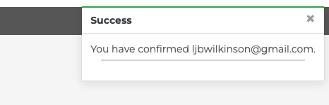

Bugs
1. Reverse URL error - had wishlist in url on wishlist template instead of Add to Wishlist - Stakcoverflow: https://stackoverflow.com/questions/25359441/using-request-meta-gethttp-referer-in-url-reverse-in-django

Resources
https://favicon.io/ for creation of favicon
https://www.youtube.com/watch?v=OgA0TTKAtqQ&list=PLOLrQ9Pn6caxY4Q1U9RjO1bulQp5NDYS_&index=7 for Wishlist
Adding marksafe to file: https://stackoverflow.com/questions/72013969/nameerror-name-mark-safe-is-not-defined-django

https://www.youtube.com/@YukselCELIK/search?query=Django - Tried to get product variations but could not get working

Ratings from https://github.com/dev-rathankumar/greatkart-pre-deploy/blob/main/store/models.py

Bugs: 
Login redirect error - had a login url in commented out code. Meant couldnt view product detail page when not logged in. Link; https://forum.djangoproject.com/t/reverse-for-logout-not-found-logout-is-not-a-valid-view-function-or-pattern-name-i-am-unable-to-redirect-a-url-page/10364/6
Getting sizes to display dynamically - needed to have color_id in size fields in view

Adding variations to the bag: https://github.com/LADCode2021/pp5-vape-city/blob/main/basket/contexts.py
Int errors/key errors

Fixing the footer to stay at bottom regardless of content and screen size: https://www.30secondsofcode.org/articles/s/css-footer-at-the-bottom/#:~:text=You%20can%20use%20flexbox%20to,and%20flex%2Ddirection%3A%20column%20.

Deployment - 400 Bad Request on Product detail - Slack - debug to true and got a not of suspicious operation and needed to remove slash before custom js file link at bottom of page. 
Deployment - Logos - not displaying on Heroku if they are standalone images (e.g. logo), make sure that the path in HTML is correct - /media/ will only work in Gitpod; for Heroku (and for both actually), you need {{ MEDIA_URL }} - like this: src="{{ MEDIA_URL }}my_image.jpg"

Credits
Stock images
DNL Bowers
LadCode
Privacy Policy Generator: https://www.privacypolicygenerator.info/download.php?lang=en&token=kEMrvtBBmxCnXO76kmtbmizqJIKiJ5Gq#

Who are your users?
Which online platforms would you find lots of your users?
Would your users use social media? If yes, which platforms do you think you would find them on?
What do your users need? Could you meet that need with useful content? If yes, how could you best deliver that content to them?
Would your business run sales or offer discounts? How do you think your users would most like to hear about these offers?
What are the goals of your business? Which marketing strategies would offer the best ways to meet those goals?
Would your business have a budget to spend on advertising? Or would it need to work with free or low cost options to market itself?

# EverWear 
***
## Overview 

Welcome to EverWear! EverWear is an Irish clothing brand with a focus on providing high end high quality clothing. The EverWear ethos is that all things are equal, period, no exceptions and this is reflected in the company's use of organic fairtrade materials in the production of their clothing. This means all clothes produced by the company ensure that all members of the supply chain are treated equitably and the production of the clothing does not have a negative impact on natural resources or the earth. Similarly, in a bid to avoid the impact disposable fashion is having on the planet, EverWear clothing is designed to be classic and hardwearing so it can last you a lifetime. This site is the online store for EverWear.

## Live Site

[EverWear](https://project-5.herokuapp.com/)

## Repository 

[GitHub Repository](https://github.com/LW83/Project-5-EverWear)

***
## Table of Contents:
* [**EverWear**](#everwear)
  * [**Overview**](#overview)
  * [**Concept and Planning**](#concept-and-planning)
    * [**UX**](#ux)
    * [**Logic**](#logic)
    * [**Design**](#design)
    * [**Wireframes**](#wireframes) **************************
    * [**Database Planning**](#database-planning)
  * [**Existing Features**](#existing-features)
    * [**Landing Page**](#landing-page)
    * [**User Dashboards**](#user-dashboards)
    * [**Views**](#views)
  * [**Feature Enhancements**](#feature-enhancements)
  * [**Testing**](#testing)
    * [**User Story Testing**](#user-story-testing)
    * [**Features Testing**](#features-testing)
    * [**Permissions Testing**](#permissions-testing)
    * [**Browser Testing**](#browser-testing)
    * [**Code Validation Testing**](#code-validation-testing)
    * [**Lighthouse Performance Testing**](#lighthouse-performance-testing)
    * [**Accessibility Testing**](#accessibility-testing)
    * [**Fixed Bugs**](#fixed-bugs)
    * [**Unfixed Bugs**](#unfixed-bugs)
  * [**Deployment**](#deployment)
    * [**Workspace SetUp**](#workspace-setup)
    * [**Deployment**](#deployment-1)
  * [**Languages, Technologies & Libraries**](#languages-technologies--libraries)
    * [**Languages Used**](#languages-used)
    * [**Technologies Utilised**](#technologies-utilised)
  * [**Credits**](#credits)
    * [**Resources**](#resources)
    * [**Code Utilisation**](#code-utilisation)

***
## Concept and Planning 

### UX

- __Target Audience__

   - This is a B2C website for the sale of high end casual wear. The target audience for this application are primarily male and female consumers in the 18-40 age demographic.

- __User Stories__

   - As a consumer I want to easily see what products are available so that I can decide if I wish to purchase anything
   - As a consumer I want to be able to search for a product
   - As a consumer I want to be able to view categories of products
   - As a consumer I want to be able to see more details for a specific product so that I can decide if I wish to purchase it
   - As a consumer I want to be able to select the size and colour of product I wish to purchase
   - As a consumer I want to add items I wish to puchase to my bag 
   - As a consumer I want to be able to view the items I currently have in my bag and decide whether to purchase these or continue shopping
   - As a consumer I want to be able to update the contents of my bag prior to checkout so that they reflect what I wish to buy
   - As a consumer I want to purchase items that I know are in stock so that I know I will receive the items soon
   - As a consumer I want to be able to find out about shipping information so that I know pricing and delivery timelines
   - As a consumer I want to be able to easily and efficiently complete payment for my items
   - As a consumer I want to enter payment details in a way that keeps the information secure and private
   - As a consumer I want to receive confirmation of my orders so that I know they have been received
   - As a consumer I can contact the store so that I can clarity any questions or issues in relation to my order
   - As a consumer I want to be able to create an account so I can make purchases more easily
   - As a consumer I want to be able to create an account so that I can leave reviews on purchases I have made
   - As a consumer I want to be able to sign up to receive information of new products or special offers
   - As a consumer I want to view my previous orders so that I can see what I previously ordered and when
   - As a consumer I want to be able to manage my profile information so that I can update it for any changes
   - As a consumer I want to be be able to add items to a wishlist so that I can potentially purchase these items later
   - As a consumer I want to be able to easily log out of my account and reset my password if required to ensure my account information is secure. 
   - As a user I want to be able to navigate the site easily and intuitively
   - As a consumer I want to be able to find out more about the company and its ethos so that I can decide it they are a company I wish to purchase from
   - As a consumer I want to know how my information is utilised so that I can decide if I wish to use the site
   
   - As store owner I can update product details so that the store reflects the latest stock information and prices
   - As store owner I can add new products so that the store reflects the latest stock offerings
   - As store owner I can remove products so that the store reflects the latest stock offerings
   - As store owner I can manage orders based on queries from customers so that the orders are correct

- __Site Aims__
 
  - The site aims to meet the above user requirements through the following: 
    - Providing an option to log in or register for an account upon reaching the landing homepage if desired.
    - Users can easily navigate to the element of the site they wish to use be it informational or browsing of products.
    - Users can easily view all products, search for products, sort products as desired and view further product specific information. 
    - Users can select the specific product variation they desire to purchase and add it to their bag.
    - Logged in users alternatively can add an item to their wishlist. 
    - From their bag users can edit all contents to finalise the items and quantity they wish to purchase before proceeding to checkout. 
    - Users can complete their purchases safely, efficiently and securely and receive confirmation that their order has been successfully processed. 
    - Logged in users can leave reviews for products if desired. 
    - Logged in users can edit their profile information and view historic order information. 
    - Users can logout upon completion of their session in order to keep their profile and information secure. 
    - Users can opt to subscribe to the company newsletter if desired.
    - Useful information is provided to the user in the form of About Us, Shipping and Privacy information. 
    - Key store management functionality can be accessed from the front end of the site for superusers without the need to access the Admin panel. 

### Design

- The design of the site is intended to be simple and functional with a visually appealing interface that reflects the brand, values and marketing style of the company.
-  The core site aim is to be the online store for the brand with additional useful company information accessible from the site.  
- Google fonts (Montserrat) has been used. In selecting the font, I wanted a powerful, highly legible font style to make a statement. Sans serif fonts are considered clean and modern and can help demonstrate a no-nonsense attitude which is fitting for EverWear. They are also often considered good for clothing brands. 
- In addition, a favicon of the E from the brand name has been created and added as a favicon for the page for brand consistency across the site. 

SITE INSPIRATIONS??

### Database Planning

- The final model structure implemented for the site is as follows: 

- The model attributes in yellow are not currently utilised in the site functionality but are there to support future feature enhancements noted below. These have not been implemented due to time constraints on the project. 

***
## Existing Features 

### Landing Page

 - On arrival at the page, there is a simple landing page with a Shop button and Account icon. This landing page was created to add to the feel of the brand and to give the impression of a gateway into the site. 
 - The Shop button takes the user to the homepage of the site. 

 - The account icon for a logged out user gives the option of Register or Login and will direct the user to the respective page accordingly.

 - The account icon for a logged in superuser gives the account options of Manage Store, My Profile and Logout. For non-superusers, a logged in viewer will only see My Profile and Logout.

__Log In__

  - Upon selecting Login, the user is taken to the log in screen to enter their information. 
  - From this view, the user also has a Register or Login button in the top right corner of their screen as part of the header. This is in case the user easily wishes to navigate to Register instead of Login.

  - If the details entered are incorrect, they will receive an error notification.

  - Once logged in the user will see a success message confirming their sign in.

__Register__

 - If the user opts to Register they will be taken to the Sign Up screen to do so.

 - This form will display errors if the fields are not completed correctly.  

 - Once submitted, the user is notified that a confirmation email has been sent to the email address submitted. 

 - The user receives an email from which they can validate their account. 

 - They then receive a final confirm step and a success message when signed in. 

 
 

### HomePage

 - The homepage is the core page for the user from where they can select which products, product categories or information pages they wish to view. 

__Search Functionality__
 - From the search box at the top of the page the user can search for a product name or description and see what products are available. 

 
 

 
 

__All Products__
 - From the navigation bar the user can select to view all products by price or by category.
 - Multiple product pages display a card of the product with an image (or no image image if not available), the product name, product category, price and rating. 

  
  

__Category__
 - From the navigation bar or from the category card on the homepage, the user can select to view all products of a specific category.

  

__Sort Functionality__
 - The user may also sort the products displayed by various criteria from the sort box.

  

### Product Page

__Product Display__
 - The top half of the product detail page displays the product name, price, average and count of reviews for the product, product description and purchase options. 
 - The user can navigate back to the Products listing via the Keep Shopping link or back to the Homepage or Product Category via the breadcrumbs.

  

__Options__
 - The Add to Bag button is inactive on the product bag until both a color and size option have been selected in order to avoid items being added to the bag without proper specifications. 

  

 - On selecting the color, this option will be highlighted and the size options available for that color will be displayed. 

  
  

__Reviews__
 - The bottom half of the product detail page displays a marketing image set for the category in question and reviews for the product being viewed.

  

 - If the user is logged in and has not left a review for that product they will have the option to 'Add a Review'

  

  - If the user wishes to add a review, clicking the Add a Review button will produce a modal where they can provide rating text and a score out of 5. Once submitted this will auto refresh the reviews and the review count and average.

  

  - If the user is not logged in, they will be able to see reviews left but will not have the option to Add a Review.

  

  - Reviews can be deleted by superusers from the Admin panel if required.  

__Add to Bag__

- Once the color, size and quantity has been selected and added to the bag, a success message is displayed showing the user what they added, their current bag total and the delta to getting free delivery if applicable. 

  

__Add to Wishlist__

 - For users that are not logged in, clicking the Add to Wishlist button on the product page will reroute them to the login page for the site. 

 - For logged in users, adding a product to the wishlist will display a success message. 

  

### Bag
 - From their bag which can be accessed via the bag icon at the top of the page, the checkout link in the footer or the checkout link in the add to bag pop up message, the user will see each product they have added to their bag in an individual line for that product specification.  
 - The line details the product image (bar on small mobile screens), name, size, color, sku, individual price and quantity, the subtotal (bar on small mobile screens) and the option to update the quantity or remove the item from the bag. 
 - The total, delivery cost and grand total are displayed at the bottom with the option to proceed to payment or to keep shopping. 

  
  

 - The user can also tell if there are items in their bag as the bag icon will turn blue.

  

 - If the user changes the quantity of a specific product variation in their bag they will receive a success message with the details and the bag totals will recalculate. 

  

 - If the user deletes and item from their bag, that specific product variation will be removed, a sucess message displayed and the bag total recalculated. 

  

 - If the user does not have any items in their bag, the follow view will be displayed: 

  

  
### Wishlist
 - The user can view their wishlist by clicking the heart button at the top of the screen or the Wishlist link in the footer. This will display the products that they have added to their wishlist. 

  

 - If they wish to purchase the item clicking on the product name will take them to the product detail page for that product.

 - If they wish to remove the item from their wishlist, they can click the Remove button and they will see a success message that the item has been removed. 

  

 - If the users wishlist is empty they will see the following view:
  
  

### Checkout
 - On proceeding to checkout the user can complete the delivery information and see a summary of their order. 
 - The delivery information is pre-populated for a logged in user where this has been completed in their profile. Alternatively, the can select to save their populated information to their profile. 

  

 - If any required information is not populated validation messages will be displayed. 

  

 - If there is any issue with the credit card information entered, warning messages will be displayed. 

  
  
  

__Order Confirmation__
 - Upon successful processing of a payment, the order confirmation page will be displayed to the user and a success message.

  

 - The user will also receive an email confirming their order to the email address logged as part of the order completion. 

  

 - The order will also display in the Admin where the store owner can edit/delete or update the fulfillment status of the order.

  

### Profile 
 - For logged in users, the My Account section of the site is accessible from the account icon in the top right of the page or via the link in the footer. This will display their save order delivery information which can be updated as needed and their order history. 

 - If information is updated, the user will receive a success message if saved successfully. 

 - If the user selects to view a historic order they will be shown the details of the order and an alert that it is historic.

### SuperUser

__Manage Store__
 - If the logged in user has superuser rights, from the My Account icon they will have the option of Manage Store. 
 - From Manage Store various product management activities can be performed.

 

__Add Category__
 - The Add Category functionality will enable superusers to create a new product category. 

 

 - When added the user will receive a success message.

 

 - The new category will autopopulate a category card on the homepage with the image selected.

 

 - The new category will be available to select from in the Add Product functionality.

 

 - The new category is visible in the admin panel for editing/deletion.

 

__Add Product__

- The Add Product functionality will enable superusers to create a new product. 

 

 - When added the user will receive a success message.

 - The new product will autocreate a product on the site under the respective category chosen with the image selected.

 ![Homepage](./media/readme/functionalilty/added_product.png

 - NOTE: Currently variations for the new product need to be added via the Admin panel, but a future feature development is to enable this through the front end also. This was no feasible due to time constraints.

 - The new product is visible in the admin panel for editing/deletion.

__Edit Product__

__Delete Product__

__Admin Panel__

__Order Status__

### Logout

### Footer

__Social Media__

__Informational Pages__

__Newsletter__

### Error 404 Page

***
## Feature Enhancements

 - There are a number of feature enhancements that I believe would be beneficial to the site and further enhance its usefulness to the user but which I was time constrained to try and incorporate prior to the submission deadline for this project. These include: 

     - 
       
***
## Testing 

### User Story Testing

 - All user stories identified have been tested against the final design with the outcome of this testing set out below. 

### Features Testing

 - All design features have been manually tested with the outcome of this testing set out below. 
 - Screenshots have also been included in the Features section above to show the validation output for the various steps completed by the user. 
 - Testing was completed in my local terminal and also in Heroku post deployment. 

### Permissions Testing

 - All urls have been tested to ensure that only the correct user profiles can access the functionality available to them. The outcome of this testing is set out below. 

### Browser Testing
  - The site was developed and tested using Google's Chrome browser. 
  - The site has also been tested on Safari and functions as intended. 

  - The site has been tested for responsiveness across the different pages of the site on different screen sizes. The outcome of this testing is set out below.  

 
### Code Validation Testing 

  - The site code has been passed through the following online validation tools: 

  

__HTML Validation__
  
  - There are no errors for the site when passed through the W3C validator. 

  

__CSS Validation__

  - There are no errors for the site when passed through the W3C validator. Warnings were found in relation to the links for Bootstrap and Font Awesome. These were left as is. 

  

__Python Validation__

  - The only issues found in any of the python files when passing through the Pep8CI online validator related to line length and some of these were deliberately left as is mostly to avoid impacting the functionality of the code and in a few instances due to the code being easier to read when left as is. 

### Lighthouse Performance Testing

  - Lighthouse testing was performed on the site with perfomance and accessibility scores consistently in the 90%+ range.

  
  ![Login Lighthouse]
  ![Sign Up Options Lighthouse]
  ![Registration Lighthouse]
  ![Dashboard Lighthouse]
  ![Current Dogs Lighthouse]
  ![Add a Profile Lighthouse]
  ![Edit a Profile Lighthouse]
  ![My Current Dogs Lighthouse]
  ![My Bookings Lighthouse]
  ![My Proposed Bookings Lighthouse]
  ![My Previous Dogs Lighthouse]

### Accesibility Testing

  - In addition to the lighthouse reports, site accessibility was also tested via [Accessibility Test](https://accessibilitytest.org/) with a score of 98%.

  

### Fixed Bugs   
  - The following key bugs arose and were fixed during the development of the site: 

    1. Login template not being identified: 
          - Issue:  
          - Solution: 
          - Resource:  
      
### Unfixed Bugs
- The are no existing bugs that remain unfixed in the site however there are feature enhancements as noted above that I would like to incorporate into the functionality of the site but was time constrained in completing these items prior to submission.   

***

## Deployment

### Workspace SetUp

Steps to Set up Workspace and Install Django:

 - In your repository install Django and gunicorn with the following command: pip install 'django<4' gunicorn
 - Install supporting libraries:
          pip install dj_database_url psycopg2
          pip install dj3-cloudinary-storage
- Create a requirements.txt file:
          pip freeze --local > requirements.txt
- Create a project via the following command:
          django-admin startproject PROJECT_NAME . (in the case of this project, the project name was "project4")
- Create an app within the project:
          python manage.py startapp APP_NAME (in the case of this project, the app name was "connector")
- Add your new app to the list of installed apps in setting.py
- Migrate these changes via:
          python manage.py migrate
- Test the server works locally:
          python manage.py runserver (Should display Django success page) 

### Deployment

- Prior to deployment in Heroku a database was set up with ElephantSQL, the site was then deployed to Heroku following the below deployment steps: 
  
  Heroku:
   - Log in to Heroku (or create an account if required).
   - Click 'Create a new app'.
   - Enter a name for the app (must be unique). I selected project4new. 
   - Select your region. For me, this is Europe being based in Ireland. 
   - Select "Create app".
   - In the new page for the app, select the Settings tab from the menu at the top of the main screen. 
   - In the Heroku Settings page, go to the 'Config Vars' section and select "Reveal Config Vars".
   - Select 'Add' in the Settings tab of Heroku; in this line enter 'PORT' in the 'Key' field and a 'Value' of 8000. 
   - In these Settings all relevant secret keys and database URLs are also added. 
   
  Gitpod:

    Env.py file
    - These database and secret key URLs are also added to your env.py file in gitHub and this file is included in the gitignore file to ensure config vars are not publically available on Github.
    - In env.py import os
    - Add os.environ["DATABASE_URL"] = "Paste in ElephantSQL database URL"
    - os.environ["SECRET_KEY"] = "Paste in your randomSecretKey"

    Settings.py file
    - Under from pathlib import Path add:
        import os
        import dj_database_url
        if os.path.isfile("env.py"):
          import env
    - Replace the secret key: SECRET_KEY = os.environ.get('SECRET_KEY')
    - Update the Databases value to: 
          DATABASES = {
            'default': 
          dj_database_url.parse(os.environ.get("DATABASE_URL"))
          }
    - Migrate these changes
    - Link file to the templates directory in Heroku (Place under the BASE_DIR line) via: 
          TEMPLATES_DIR = os.path.join(BASE_DIR, 'templates')
    - Change the templates directory to TEMPLATES_DIR. Place within the TEMPLATES array
    - Add Heroku Hostname to ALLOWED_HOSTS; 
          ALLOWED_HOSTS = ["PROJ_NAME.herokuapp.com", "localhost"]
    - Create a procfile at the top level directory and add: web: gunicorn PROJ_NAME.wsgi
    - Add, commit and push the changes in the terminal

  Heroku:
   - In Heroku, select the 'Deploy' section from the menu at the top of the page. 
   - Select GitHub as the deployment method and 'Connect to GitHub'.
   - Find the right repository (here project4new) via the Search functionality and then select 'Connect'.
   - Scroll down to the new 'Manual Deploy' section and select 'Deploy Branch'
   - Wait until the deployment is finished running and select "View".

The live link can be found here: [Connector](https://project4new.herokuapp.com/) 

***

## Languages, Technologies & Libraries

### Languages Used
  - Python
  - HTML5
  - CSS3
  - Javascript
  - jQuery

### Technologies Utilised
  - The following tools and resources have been utilised in the creation of this project: 
     - [GitHub](https://github.com/) & [Gitpod](https://gitpod.io/): For development of the site. 
     - [Stackoverflow](): For general guidance and research
     - [Slack](https://slack.com/intl/en-ie/): For general guidance and research on project considerations. 
     - [W3C HTML Validator](https://validator.w3.org/)
     - [W3C CSS Validator](https://jigsaw.w3.org/css-validator/)
     - [Pep8CI Validator](https://pep8ci.herokuapp.com/#)
     - [Heroku](https://id.heroku.com/login): To deploy the site
     - [Lucidchart](https://www.lucidchart.com): To create a flow chart of the site logic ***********
     - [Elephant SQL](https://www.elephantsql.com/): For the database underpinning the site
     - [Django](https://www.djangoproject.com/): For site build framework
     - [Boostrap](https://getbootstrap.com/docs/4.0/getting-started/introduction/): For site styling
     - [Crispy Forms](https://django-crispy-forms.readthedocs.io/en/latest/): For use in across all forms on the site
     - [Font Awesome](https://fontawesome.com/): For icon used on site
     - [Google Fonts](https://fonts.google.com/): For site fonts
     AWS
     Google Icons
     Privacy Generator
     Tiny PNG
     https://www.xml-sitemaps.com/

***
## Credits   

### Resources
 - The following resources were key to helping me build functionality critical to the working of the site: 
   - For getting object by id: https://stackoverflow.com/questions/73338018/how-to-get-an-object-by-id-in-django
   - For Int Pk URL structure: https://github.com/fabricius1/DjangoFilmsCRUD/blob/master/films/urls.py
   - For adding delete button to table rows: https://stackoverflow.com/questions/60616526/how-to-add-delete-button-in-each-row-of-my-table
   - Delete buttons: https://stackoverflow.com/questions/55705666/django-tables2-with-edit-and-delete-buttons-how-to-do-it-properly
   - For adding extra fields in registration form: https://stackoverflow.com/questions/45708119/how-to-add-extra-fields-to-django-registration-form
   - For creating an AND Django filter: https://stackoverflow.com/questions/769843/how-to-use-and-in-a-django-filter
   - For adding calendars to dates in forms through DatePicker Plus: https://django-bootstrap-datepicker-plus.readthedocs.io/en/latest/Walkthrough.html
   - Amending Admin view to bring in additional fields: https://stackoverflow.com/questions/48011275/custom-user-model-fields-abstractuser-not-showing-in-django-admin
   - For linking the edit button to the icon: https://docs.djangoproject.com/en/4.1/intro/tutorial04/
   - To add deletion confirmation to deletion actions: https://stackoverflow.com/questions/64070378/how-can-i-use-django-deleteview-in-my-template
   - For displaying messages: https://docs.djangoproject.com/en/4.1/ref/contrib/messages/#:~:text=The%20messages%20framework%20allows%20you,%2C%20warning%20%2C%20or%20error%20).
   - To create accept and reject booking functions: https://www.w3schools.com/django/django_update_record.php
   - Bootstrap documentation
   - Django documentation

### Code Utilisation
 - The following elements of code have specifically been inspired from the following sources: 
    - Code Institute, Hello Django, I Think Therefore I Blog & Boutique Ado Demonstrations: For guidance and inspiration for this site, including guidance on deployment, messages, querysets, admin functionality, model creation and structure, url structure, form creation, pagination.  
    - As noted in the code, I also took inspiration from XYZ  and their [Out and Proud](https://github.com/keelback-code/out-proud/blob/main/README.md) project particularly in relation to the code for Creating and Editing Profiles.
    - For guidance on user types & permission decorators: https://simpleisbetterthancomplex.com/tutorial/2018/01/18/how-to-implement-multiple-user-types-with-django.html. In the end I decided on a different permssion structure for the page than using decorators but still utilised a lot of the user registration sign up from this tutorial in creating the sign up templates and views. 

