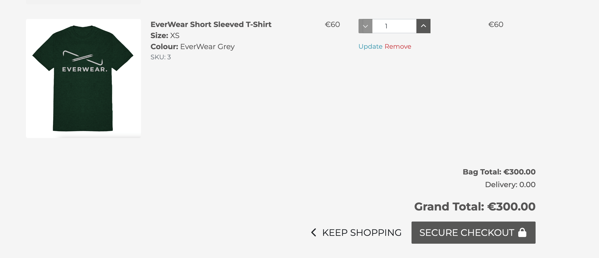
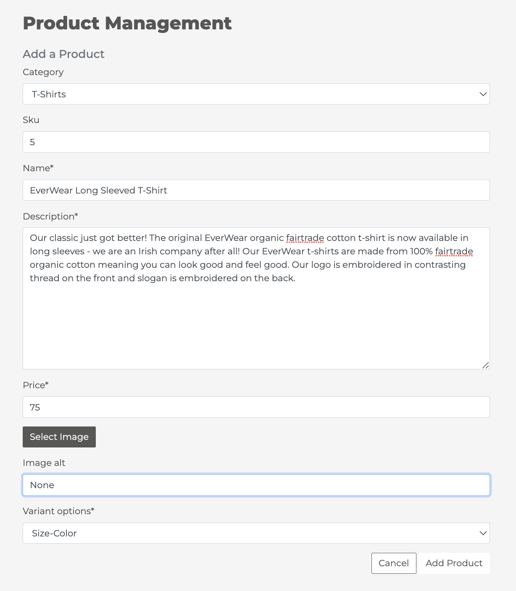
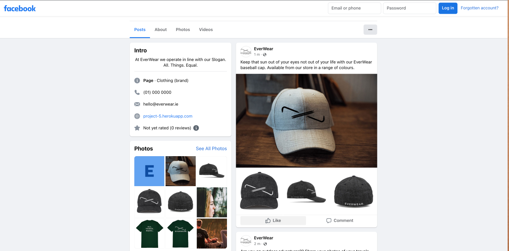
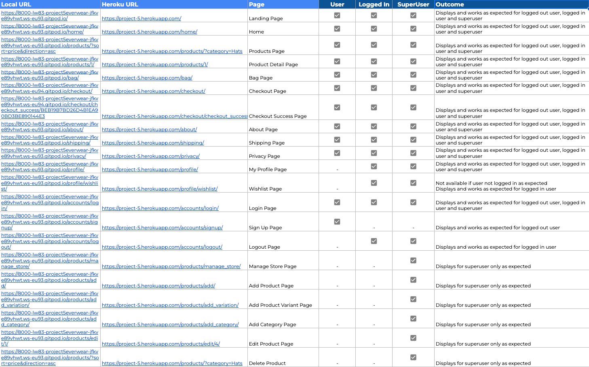

# EverWear 
***
## Overview 

Welcome to EverWear! EverWear is an Irish clothing brand with a focus on providing high end high quality clothing. The EverWear ethos is that all things are equal, period, no exceptions and this is reflected in the company's use of organic fairtrade materials in the production of their clothing. This means all clothes produced by the company ensure that all members of the supply chain are treated equitably and the production of the clothing does not have a negative impact on natural resources or the earth. Similarly, in a bid to avoid the impact disposable fashion is having on the planet, EverWear clothing is designed to be classic and hardwearing so it can last you a lifetime. This site is the online store for EverWear.

## Live Site

[EverWear](https://project-5.herokuapp.com/)

## Repository 

[GitHub Repository](https://github.com/LW83/Project-5-EverWear)

***
## Table of Contents:
* [**EverWear**](#everwear) 
  * [**Overview**](#overview) 
  * [**Concept and Planning**](#concept-and-planning) 
    * [**UX**](#ux) 
    * [**Design**](#design) 
    * [**Database Planning**](#database-planning) 
  * [**Business Model & Marketing**](#business-model--marketing) 
    * [**Business Model**](#business-model) 
    * [**Marketing**](#marketing) 
    * [**SEO Approach**](#seo-approach) 
  * [**Existing Features**](#existing-features)
    * [**Landing Page**](#landing-page)
    * [**Site Header**](#site-header)
    * [**HomePage**](#homepage)
    * [**Product Page**](#product-page)
    * [**Bag**](#bag)
    * [**Wishlist**](#wishlist)
    * [**Checkout**](#checkout)
    * [**Superuser**](#superuser)
    * [**Logout**](#logout)
    * [**Site Footer**](#site-footer)
    * [**Error 404 Page**](#error-404-page)
  * [**Feature Enhancements**](#feature-enhancements)
  * [**Testing**](#testing)
    * [**User Story Testing**](#user-story-testing)
    * [**Features Testing**](#features-testing)
    * [**Permissions Testing**](#permissions-testing)
    * [**Browser Testing**](#browser-testing)
    * [**Code Validation Testing**](#code-validation-testing)
    * [**Accessibility Testing**](#accessibility-testing)
    * [**Fixed Bugs**](#fixed-bugs)
    * [**Unfixed Bugs**](#unfixed-bugs)
  * [**Deployment**](#deployment)
    * [**Workspace SetUp**](#workspace-setup)
    * [**Deployment**](#deployment-1)
  * [**Languages, Technologies & Libraries**](#languages-technologies--libraries)
    * [**Languages Used**](#languages-used)
    * [**Technologies Utilised**](#technologies-utilised)
  * [**Credits**](#credits)
    * [**Images**](#images)
    * [**Resources & Code Utilisation**](#resources)
    * [**People**](#people)

***
## Concept and Planning 

### UX

- __Target Audience__

   - This is a B2C website for the sale of high end casual wear. The target audience for this application are primarily male and female consumers in the 18-40 age demographic.

- __User Stories__

   - As a consumer I want to easily see what products are available so that I can decide if I wish to purchase anything
   - As a consumer I want to be able to search for a product
   - As a consumer I want to be able to view categories of products
   - As a consumer I want to be able to see more details for a specific product so that I can decide if I wish to purchase it
   - As a consumer I want to be able to select the size and colour of product I wish to purchase
   - As a consumer I want to add items I wish to puchase to my bag 
   - As a consumer I want to be able to view the items I currently have in my bag and decide whether to purchase these or continue shopping
   - As a consumer I want to be able to update the contents of my bag prior to checkout so that they reflect what I wish to buy
   - As a consumer I want to purchase items that I know are in stock so that I know I will receive the items soon
   - As a consumer I want to be able to find out about shipping information so that I know pricing and delivery timelines
   - As a consumer I want to be able to easily and efficiently complete payment for my items
   - As a consumer I want to enter payment details in a way that keeps the information secure and private
   - As a consumer I want to receive confirmation of my orders so that I know they have been received
   - As a consumer I can contact the store so that I can clarity any questions or issues in relation to my order
   - As a consumer I want to be able to create an account so I can make purchases more easily
   - As a consumer I want to be able to create an account so that I can leave reviews on purchases I have made
   - As a consumer I want to be able to sign up to receive information of new products or special offers
   - As a consumer I want to view my previous orders so that I can see what I previously ordered and when
   - As a consumer I want to be able to manage my profile information so that I can update it for any changes
   - As a consumer I want to be be able to add items to a wishlist so that I can potentially purchase these items later
   - As a consumer I want to be able to easily log out of my account and reset my password if required to ensure my account information is secure. 
   - As a user I want to be able to navigate the site easily and intuitively
   - As a consumer I want to be able to find out more about the company and its ethos so that I can decide it they are a company I wish to purchase from
   - As a consumer I want to know how my information is utilised so that I can decide if I wish to use the site
   
   - As store owner I can update product details so that the store reflects the latest stock information and prices
   - As store owner I can add new products so that the store reflects the latest stock offerings
   - As store owner I can remove products so that the store reflects the latest stock offerings
   - As store owner I can manage orders based on queries from customers so that the orders are correct

- __Site Aims__
 
  - The site aims to meet the above user requirements through the following: 
    - Providing an option to log in or register for an account upon reaching the landing homepage if desired.
    - Users can easily navigate to the element of the site they wish to use be it informational or browsing of products.
    - Users can easily view all products, search for products, sort products as desired and view further product specific information. 
    - Users can select the specific product variation they desire to purchase and add it to their bag.
    - Logged in users alternatively can add an item to their wishlist. 
    - From their bag users can edit all contents to finalise the items and quantity they wish to purchase before proceeding to checkout. 
    - Users can complete their purchases safely, efficiently and securely and receive confirmation that their order has been successfully processed. 
    - Logged in users can leave reviews for products if desired. 
    - Logged in users can edit their profile information and view historic order information. 
    - Users can logout upon completion of their session in order to keep their profile and information secure. 
    - Users can opt to subscribe to the company newsletter if desired.
    - Useful information is provided to the user in the form of About Us, Shipping and Privacy information. 
    - Key store management functionality can be accessed from the front end of the site for superusers without the need to access the Admin panel. 

### Design

__Concept__

- The core site aim is to be the online store for the brand with additional useful company information accessible from the site.  
- The foundational design of the site is leveraged from the Boutique Ado walkthrough project. 
- The design of the site was then inspired by two main sites [Surfdome](https://www.surfdome.ie/) for the feel of an outdoor clothing brand website and [Miu Miu](https://www.miumiu.com/ie/en/bags/shoulder_bags/products.Matelass%C3%A9_nappa_leather_shoulder_bag.5BH211_N88_F0458_V_TWO.html) for some of the page simplicity and high end feel of the site. 
- I had originally intended to implement paralax as part of the website design utilising the striking background images however I could not get happy with a design where this was not overly distracting to the user and undermining the core purpose of the site.
- The design of the site is intended to be simple and functional with a visually appealing interface that reflects the brand, values and marketing style of the company.

__Planning__

- The core functionality that I aimed to achieve with the site was set out and documented in the [User Story board](https://github.com/users/LW83/projects/4)

__Colors__

- The color scheme adopted for the site is tied to the core colour of the Company logo which is dark grey (Hex #575656). Grey is considered a good representation of neutrality and balance which wasin keeping with the company’s desire to treat all things equally. In addition, grey tied in with the company’s fusion of the urban and outdoors with grey being reflective of streetscapes and buildings in an urban setting but also stone and rock in a more outdoor environment. This color also allows good contrast on the site for accessibility. 
- Secondary colors are black, white, EverWear Sand (Hex #daccb5), EverWear Green (Hex #00442a), EverWear Navy (Hex #101f45) and EverWear Blue (Hex #0067b2). These are the color options for which products are available and tie in with the background imagery used in the site. These colours again are representative of natural hues and shades whilst still being bold and impactful. 

__Fonts__

- Google fonts (Montserrat) has been used. In selecting the font, I wanted a powerful, highly legible font style to make a statement. Sans serif fonts are considered clean and modern and can help demonstrate a no-nonsense attitude which is fitting for EverWear. They are also often considered good for clothing brands. 

__Favicon__

- In addition, a favicon of the E from the brand name has been created and added as a favicon for the page for brand consistency across the site. 

__Imagery__

- The imagery on the site has been deliberately chosen to enhance the feel of the brand and convey what the brand represents. Powerful images help make an impression on the user and improve the user experience of the site as well as the desirability of the products. 

### Database Planning

- The final model structure implemented for the site is as follows: 

- These models are implemented as orignally planned however model attributes in yellow are not currently utilised in the site functionality. Due to time constraints some features that were not critical have been left as future feature enhancements but rather than delete these aspects of the models, they are there to support the build out of the site and future feature enhancements noted below. 

***
## Business Model & Marketing

### Business Model

- EverWear is an environmentally-friendly high quality fashion brand focused on leisurewear.
- The company is a B2C business with a target market of both men and women in the 18 to 40 age range. 
- This site acts as the online presence and store selling the full current product range direct to end consumers worldwide. 

### Marketing
The marketing plan for the company is as follows: 
 - SEO: Ensure the site is optimised for organic search in particular with the set up of Google Search Console. 
 - SEM: Focus on Google Ads campaigns to drive immediate clicks and awareness pending organic search growth. This will need to be configured to correctly track conversions to ensure accurate assessment of campaign impact. 
 - Organic Social Media: The company has established a Facebook page but an Instagram page would also be highly impactful given the visual nature of the product and the demographic targeted. Twitter will also likley be set up as a good 'real time' mechanism for interacting with consumers and any feedback or issues they may have.  
 - Social Media Advertising: Paid advertising campaigns (possibly boosted posts in the short term for budget reasons) across Facebook and Instagram to increase visibility, follows and brand awareness. Facebook pixel should also be set up to drive data from future advertising campaigns. 
 - Email Marketing: A newsletter sign up has been built into the site and periodic communications can be sent to people signed up with exclusive offers, early access to new product ranges or sales and discount codes. This will be an important way of reaching consumers already engaged with the brand and retain loyalty. 
 - Traditional Marketing: As a clothing brand, more traditional marketing channels may also be relevant such as print advertising, TV advertising and potential sponsorship or endorsement arrangements with a partner company or individual. 

The short term focus would be on Google Ads, boosted Facebook & Instagram posts and establishing e-mail marketing. Advertising budgets can be increased as the business establishes. 
  
### SEO Approach
The current steps taken to improve the SEO of the site include:
 - Inclusion of a sitemap file
 - Inclusion of a robots.txt file
 - Use of semantic HTML including nav, footer, heading, strong tags used as appropriate
 - Meta tags included in the head of all site pages
 - Good products descriptions that are consistent with key words for the company and site
 - An About Us page that gives more information about the company and its values
 - Large images have been compressed to imrpove site load times 
 - Dynamic page titles have been added for each page of the site

The inclusion of an FAQ and/or blog page on the site may also be relevant to the company and help improve SEO further. 

***
## Existing Features 

### Landing Page

 - On arrival at the page, there is a simple landing page with a Shop button and Account icon. This landing page was created to add to the feel of the brand and to give the impression of a gateway into the site. 
 - The Shop button takes the user to the homepage of the site. 

 - The account icon for a logged out user gives the option of Register or Login and will direct the user to the respective page accordingly.

 - The account icon for a logged in superuser gives the account options of Manage Store, My Profile and Logout. For non-superusers, a logged in viewer will only see My Profile and Logout.

__Mobile Views__

 
 

__Log In__

  - Upon selecting Login, the user is taken to the log in screen to enter their information. 
  - From this view, the user also has a Register or Login button in the top right corner of their screen as part of the header. This is in case the user easily wishes to navigate to Register instead of Login.

  - If the details entered are incorrect, they will receive an error notification.

  - Once logged in the user will see a success message confirming their sign in.

__Register__

 - If the user opts to Register they will be taken to the Sign Up screen to do so.

 - This form will display errors if the fields are not completed correctly.  

 - Once submitted, the user is notified that a confirmation email has been sent to the email address submitted. 

 - The user receives an email from which they can validate their account. 

 - They then receive a final confirm step and a success message when signed in. 

 
 

### Site Header

 - The header of the site is comprised of the primary header which includes the brand symbol and name, a search box, account icon, bag icon and wishlist icon.
 - Underneath this is a secondary bar which contains the core navigation elements of the site enabling a user to navigate to all products sorted by price or category (from a dropdown) or direct to a category of their choice. This bar has been styled to be consistent with the logo branding and color. 
 - The categories currently do not have dropdowns as there are no subcategories currently in the product catalogue but the ability to add these and have dropdown by category has been retained in the code. 

 

 - When a user has an item in their bag, the bag icon will turn blue to indicate that it contains an item. 

### HomePage

 - The homepage is the core page for the user from where they can select which products, product categories or information pages they wish to view. 

__Search Functionality__
 - From the search box at the top of the page the user can search for a product name or description and see what products are available. 

 
 

 
 

__All Products__
 - From the navigation bar the user can select to view all products by price or by category.
 - Multiple product pages display a card of the product with an image (or no image image if not available), the product name, product category, price and rating. 

  
  

__Category__
 - From the navigation bar or from the category card on the homepage, the user can select to view all products of a specific category.

  

__Sort Functionality__
 - The user may also sort the products displayed by various criteria from the sort box.

  

__Mobile Views__

  
  
  

### Product Page

__Product Display__
 - The top half of the product detail page displays the product name, price, average and count of reviews for the product, product description and purchase options. 
 - The user can navigate back to the Products listing via the Keep Shopping link or back to the Homepage or Product Category via the breadcrumbs.

  

__Options__
 - The Add to Bag button is inactive on the product bag until both a color and size option have been selected in order to avoid items being added to the bag without proper specifications. 

  

 - On selecting the color, this option will be highlighted and the size options available for that color will be displayed. 

  
  

__Reviews__
 - The bottom half of the product detail page displays a marketing image set for the category in question and reviews for the product being viewed.

  

 - If the user is logged in and has not left a review for that product they will have the option to 'Add a Review'

  

  - If the user wishes to add a review, clicking the Add a Review button will produce a modal where they can provide rating text and a score out of 5. Once submitted this will auto refresh the reviews and the review count and average.

  

  - If the user is not logged in, they will be able to see reviews left but will not have the option to Add a Review.

  

  - Reviews can be deleted by superusers from the Admin panel if required.  

__Add to Bag__

- Once the color, size and quantity has been selected and added to the bag, a success message is displayed showing the user what they added, their current bag total and the delta to getting free delivery if applicable. 

  

__Add to Wishlist__

 - For users that are not logged in, clicking the Add to Wishlist button on the product page will reroute them to the login page for the site. 

 - For logged in users, adding a product to the wishlist will display a success message. 

  

__Mobile Views__

  
  

### Bag
 - From their bag which can be accessed via the bag icon at the top of the page, the checkout link in the footer or the checkout link in the add to bag pop up message, the user will see each product they have added to their bag in an individual line for that product specification.  
 - The line details the product image (bar on small mobile screens), name, size, color, sku, individual price and quantity, the subtotal (bar on small mobile screens) and the option to update the quantity or remove the item from the bag. 
 - The total, delivery cost and grand total are displayed at the bottom with the option to proceed to payment or to keep shopping. 

  
  

 - The user can also tell if there are items in their bag as the bag icon will turn blue.

  

 - If the user changes the quantity of a specific product variation in their bag they will receive a success message with the details and the bag totals will recalculate. 

  

 - If the user deletes and item from their bag, that specific product variation will be removed, a sucess message displayed and the bag total recalculated. 

  

 - If the user does not have any items in their bag, the follow view will be displayed: 

  

__Mobile Views__

  

### Wishlist
 - The user can view their wishlist by clicking the heart button at the top of the screen or the Wishlist link in the footer. This will display the products that they have added to their wishlist. 

  

 - If they wish to purchase the item clicking on the product name will take them to the product detail page for that product.

 - If they wish to remove the item from their wishlist, they can click the Remove button and they will see a success message that the item has been removed. 

  

 - If the users wishlist is empty they will see the following view:
  
  

### Checkout
 - On proceeding to checkout the user can complete the delivery information and see a summary of their order. 
 - The delivery information is pre-populated for a logged in user where this has been completed in their profile. Alternatively, the can select to save their populated information to their profile. 

  

 - If any required information is not populated validation messages will be displayed. 

  

 - If there is any issue with the credit card information entered, warning messages will be displayed. 

  
  
  

 __Mobile Views__

  

__Order Confirmation__
 - Upon successful processing of a payment, the order confirmation page will be displayed to the user and a success message.

  

 - The user will also receive an email confirming their order to the email address logged as part of the order completion. 

  

 - The order will also display in the Admin where the store owner can edit/delete or update the fulfillment status of the order.

  

### Profile 
 - For logged in users, the My Account section of the site is accessible from the account icon in the top right of the page or via the link in the footer. This will display their save order delivery information which can be updated as needed and their order history. 

 - If information is updated, the user will receive a success message if saved successfully. 

 - If the user selects to view a historic order they will be shown the details of the order and an alert that it is historic.

### SuperUser

__Manage Store__
 - If the logged in user has superuser rights, from the My Account icon they will have the option of Manage Store. 
 - From Manage Store various product management activities can be performed.

 

__Add Category__
 - The Add Category functionality will enable superusers to create a new product category. 

 

 - When added the user will receive a success message.

 

 - The new category will autopopulate a category card on the homepage with the image selected.

 

 - The new category will be available to select from in the Add Product functionality.

 

 - The new category is visible in the admin panel for editing/deletion.

 

__Add Product__

 - The Add Product functionality will enable superusers to create a new product. 

 

 - When added the user will receive a success message.

 - The new product will autocreate a product on the site under the respective category chosen with the image selected.

 

 - The newly added product can then be selected in the Add Product Variant functionality. 

 

 - The new product is visible in the admin panel for editing/deletion.

 

__Add Product Variant__

- The Add Product Variant functionality will enable superusers to create a new product variant. 

 

 - When added the user will receive a success message.

 

 - The newly added product variation can then be seen in the store for selection by customers. 

 

 - The new product variant is visible in the admin panel for editing/deletion.

 

__Edit Product__

- Superusers can edit products from the product card itself.

- Selecting Edit will bring the Superuser to the product information which can be edited and saved. 

- The user will also be shown an alert message when a product is being edited. 

- The user then gets a success message when this update has been successfully made.

- All changes are then reflected on the site and in the Admin panel. 

__Delete Product__

- Superusers can delete products from the product card itself.

- The user then gets a success message when the product has been successfully deleted.

- All changes are then reflected on the site and in the Admin panel. 

__Admin Panel__

- All core aspects of the site including products, orders, users and reviews can be managed from within the Admin panel. 

- The order status can also be updated to reflect the current fulfillment status. 

### Logout

- If a user wishes to log out they can select this from the My Account icon and will be taken to the sign out page. 

- Upon signing out the user will be redirected to the landing page of the site. 

### Site Footer

- The footer of the site is styled to maintain consistency with the rest of the site. The text-muted style has been used as whilst this is less readable it improved the look of the site and was considered to be acceptable for the footer alone as a items were either duplication links or links less frequently accessed by users. 

- The My Account links in the footer replicate the links in the navigation bar to give the user another option for navigating the site.

__Social Media__

- Social media links to Facebook, Twitter and Instagram have been included all of which open in a new tab. 
- A dummy Facebook page has been created and linked. The links for Twitter and Instagram are to the respective homepages only. 

__Informational Pages__

 - The footer contains links to an About Us page, Shipping & Returns page and Privacy Policy page. 

 
 
 

__Newsletter__

- A user has the option to subscribe for the company newsletter from within the footer if they desire. 
- This has been implemented using Mailchimp.
- A success message is displayed on successful sign up. 

__Mobile Views__

### Error 404 Page

- In the event that the user is routed to a page that does not exist they will see a custom 404 error page. 

***
## Feature Enhancements

 - There are a number of feature enhancements that I believe would be beneficial to the site and further enhance its usefulness to the user but which I was time constrained to try and incorporate prior to the submission deadline for this project. Some of the model set up has already been implemented with the view to implementing some of these functionalities. These include: 

     - Further CRUD functionality: Enhancing the ability for superusers to manage the store from the front end by including the ability to edit/delete categories, edit/delete product variants, and add/edit/delete colors, sizes and image variants.
     - Image carousel: Implement an image carousel on the product detail page to display the various image variants for a product.
     - Stock functionality: Implement a check whereby if the stock for the specific product color and size is less than 1, the product variant will not be available. 
     - Stock funtionality: Update the stock number when an order is completed or an order is deleted. 
     - Sale price functionality: Where a sale price is in place for a product variant display this price and charge this price for a product variant selected. 
     - Error pages: Further error pages to be built into the site
     - Contact Us: Model to be implemented to enable better tracking of queries and their status.
     - Reviews: Ability for User to edit and delete their reviews.
     - Navigation Bar: Implement dynamic update for new category.
     - Bag: Add empty bag button to clear bag in one action.  
     - Wishlist: Add ability to add specific product variation to wishlist and ability to add to bag from within wishlist. 
     - Login: Implement social media sign in functionality.
     - Discount codes: Enable functionality to add discount code at checkout.
     - Delete: Add warning prior to deletion of categories/products/variants.
     - Product Suggestions: Implement product suggestions section to bag and product detail pages. 

***
## Testing 

### User Story Testing

 - All user stories identified have been tested against the final design with the outcome of this testing set out below. 

  

### Features Testing

 - All design features have been manually tested with the outcome of this testing set out below. 
 - Screenshots have also been included in the Features section above to show the validation output for the various steps completed by the user. 
 - Testing was completed in my local terminal and also in Heroku post deployment. 

  

### Permissions Testing

 - All urls have been tested to ensure that only the correct user profiles can access the functionality available to them. The outcome of this testing is set out below. 

  

### Browser Testing
  - The site was developed and tested using Google's Chrome browser. 
  - The site has also been tested on Safari and functions as intended. 

  

  - The site has been tested for responsiveness across the different pages of the site on different screen sizes. The outcome of this testing is set out below.  

  

  - The outcome at an individual page level is set out below. 

  
 
### Code Validation Testing 

  - The site code has been passed through the following online validation tools: 

  

__HTML Validation__
  
  - There are 3 errors remaining for the site when passed through the W3C validator. 

__CSS Validation__

  - There are no errors for the site when passed through the W3C Jigsaw validator.  

__Python Validation__

  - The only issues found in any of the python files when passing through the Gitpod Linter related to line length and some of these were deliberately left as is mostly to avoid impacting the functionality of the code and in a few instances due to the code being easier to read when left as is. 

__JS Validation__
  
  - There are no errors for the site when passed through the JSHint validator. 
  - Scripts at the bottom of HTML templates were also checked with no warnings.

### Accessibility Testing

  - In addition to the lighthouse reports, site accessibility was also tested via [Accessibility Test](https://accessibilitytest.org/) with a score of 90%.
  - There are areas where this score can be improved that were not feasible to implement in time. Other areas have been deliberate choices such as displaying text in the footer in lighter grey for visual purposes and given the frequency of access. 

  

### Fixed Bugs   
  - During this project I found there was a lot of trial and error in getting functionality to work as expected and get objects to display as desired but the following are the key bugs that arose and were fixed during the development of the site: 

    
    1. Displaying Color and Size fields Dynamically:
          - Issue: I wanted to display sizes dynamically in that the sizes that were available for a certain color would display once the color had been selected. This was not feeding through and I was not getting the size options displaying. 
          - Solution: In the product detail view I needed to have color_id in size fields in order for the sizes to correctly display for the given color. 
          - Resource: CodeArtisanLab eCommerce Tutorial
    2. Variations - Add to Bag:
          - Issue: I had configured my product detail page and my Add to Bag view but was finding that the color and size options were not coming through to the bag. 
          
          - Solution: 
            A. As the color and size options were configured as inputs with a button type they did not seem to be picking up the value of the selected item (color or size). I created a hidden input field below them on the product detail page with some javascript to pick up selected color and size attributes and add it as the value of the hidden button which enabled me to pass this to the add to bag view. 
            B. The Add to Bag view was still not pulling through the color and size attributes of the product selected so ultimately I had to create an item in the view that pulled in both the size and color values to allow the specific product variation to be added to the bag. 
          - Resource: Use of hidden input field was via research of Stackoverflow. Resolution of the Add to Bag view was a combination of reworking Boutique Ado code and code from LadCode2021 Vape City (see credits below).
    3. Variations - Remove from Bag:
          - Issue: When first implemented, my remove from bag view was removing all products of that type from the bag rather than the specific product variation i.e. if I had two hoodies in my bag, one black and one navy if I removed one all hoodies were removed which would have made for a very frustrating user experience.  
          - Solution: After a bit of trial and error I ended up basically using the same code as the add to bag view to remove the product variant from the bag and updated the script in the template to also pick up the size and color variants being removed. 
          - Resource: Self resolved through trial and error of reworking Boutique Ado code.
    4. Webhook & Confirmation emails:
          - Issue: During testing I realised my confirmation emails were not sending which made me check the Stripe dashboard to see what was happening with the webhooks. Whilst the orders were being created successfully, the webhook was failing and so no confirmation email was being sent. 
          - Solution: First, I updated the endpoint in Stripe for gitpod as the server id had changed. I imported Stripe within the webhook file. Then I had realised I had not added the code to get the Stripe charge object or updated the billing_details and grand_total variables within the Webhook handler.
                          stripe_charge = stripe.Charge.retrieve(intent.latest_charge)
            With this all fixed the payment intents were succeeding in Stripe but no emails were being sent. After reviewing the code I realised I had an extra checkout in the file path to the confirmation emails which was stopping the emails from being sent out. 
          - Resource: Support from Jason in Tutor Support on the Webhook handler, the rest was self resolved. 
    5. URL Errors: 
          - Issue: Clicking from the products page to the product detail page was throwing me a reverse URL error
          
          - Solution: After a bit of research I realised it was as simple as the fact that I had wishlist in the url of the product detail template instead of add_to_wishlist
          - Issue: When not logged in it was not possible to view the product details page as a NoReverseMatch error was being raised
          
          - Solution: I realised that there was a login url in a snippet of commented out code in the product detail page. I had not appreciated that this would throw an error if commented out but once removed the issue was resolved. 
          - Resource: General research on reverse urls on Stackoverflow & Djangoproject.com
    6. Footer: 
          - Issue: My footer would not play nice and was either fixing mid-page below the content or fixing to the bottom regardless of main content height.
          - Solution: I added the following to the base css file: 
                                  body {
                                        min-height: 100vh;
                                        display: grid;
                                        grid-template-rows: 1fr auto;
                                      }
          - Resource: 30 Seconds of Code https://www.30secondsofcode.org/articles/s/css-footer-at-the-bottom/#:~:text=You%20can%20use%20flexbox%20to,and%20flex%2Ddirection%3A%20column%20.
    7. Heroku Deployment: 
          - Issue: On deployment to Heroku, I was getting a 400 Bad Request on the product detail page. 
          - Solution: I temporarily switched debug to true and got a warning suspicious operation in the custom JS file. I needed to remove slash before custom js file link at bottom of page which resolved the issue.
          - Resource: Slack Community
          - Issue: On deployment to Heroku, the brand symbols were not displaying on the landing page or homepage despite all images having been loaded to AWS.  
          - Solution: After some resarch on Slack I found that if images are standalone images such as logos the /media/ file path will only work in Gitpod; for Heroku I needed to use {{ MEDIA_URL }} as part of the source url e.g. src="{{ MEDIA_URL }}my_image.jpg. Once this was changed the images displayed fine.
          - Resource: Slack Community

### Unfixed Bugs
- The are no known bugs that remain unfixed in the site that impact functionality however there are some minor styling items on the site that it was not possible to fix before the submission deadline: 
 - Bag page: The quantity input box border is slightly visible through the decrease quantity button when the quantity is 1.
 - Bag page: On screens under 420px wide a line appears under the checkout button which despite having inspected I have not been able to resolve what is causing it. 
 - Checkout page: The spinner on the loading page is slightly off centre and needs to be centred. 
 - Products page: The sort box is not sitting fully to the right of the page as I would like for aesthetic reasons. 
 - Product detail page: The size options for Hoodies are not displaying in sequential order (XS, S, M, L, XL), I think this is due to the original data entry in the backend on setting up the product but have not had time to fix.
 - Wishlist: When an item is added to the wishlist the heart icon should turn red to display to the user that there are items in their wishlist. This is currently only displaying when the user is in the wishlist so the code needs to be reworked to correct this. 
 - Search on Mobile: The search icon is very slightly out of line with the remaining icons in the nav bar on a mobile view. 

- In addition, there are feature enhancements as noted above that I would like to incorporate into the functionality of the site at a futre point as well as looking at refactoring the code where possible and implementing some of the recommended accessability enhancements. 

***

## Deployment

### Workspace SetUp

Steps to Set up Workspace and Install Django:

- In your repository install Django and gunicorn with the following command: pip install 'django<4' gunicorn
- Install supporting libraries:
          pip install dj_database_url psycopg2
          pip install dj3-cloudinary-storage
- Create a requirements.txt file:
          pip freeze --local > requirements.txt
- Create a project via the following command:
          django-admin startproject PROJECT_NAME . 
- Create an app within the project:
          python manage.py startapp APP_NAME 
- Add your new app to the list of installed apps in setting.py
- Migrate these changes via:
          python manage.py migrate
- Test the server works locally:
          python manage.py runserver (Should display Django success page) 

### Deployment

- Prior to deployment in Heroku a database was set up with ElephantSQL, the site was then deployed to Heroku following the below deployment steps: 
  
Heroku:
   - Log in to Heroku (or create an account if required).
   - Click 'Create a new app'.
   - Enter a name for the app (must be unique).
   - Select your region. For me, this is Europe being based in Ireland. 
   - Select "Create app".
   - In the new page for the app, select the Settings tab from the menu at the top of the main screen. 
   - In the Heroku Settings page, go to the 'Config Vars' section and select "Reveal Config Vars".
   - Select 'Add' in the Settings tab of Heroku; in this line enter 'PORT' in the 'Key' field and a 'Value' of 8000. 
   - In these Settings all relevant secret keys and database URLs are also added. 
   
Gitpod:

  Env.py file
  - These database and secret key URLs are also added to your env.py file in gitHub and this file is included in the gitignore file to ensure config vars are not publically available on Github.
  - In env.py import os
  - Add os.environ["DATABASE_URL"] = "Paste in ElephantSQL database URL"
  - os.environ["SECRET_KEY"] = "Paste in your randomSecretKey"

  Settings.py file
  - Under from pathlib import Path add:
      import os
      import dj_database_url
      if os.path.isfile("env.py"):
        import env
  - Replace the secret key: SECRET_KEY = os.environ.get('SECRET_KEY')
  - if 'DATABASE_URL' in os.environ:
            DATABASES = {
                'default': dj_database_url.parse(os.environ.get('DATABASE_URL'))
            }
            else:
                DATABASES = {
                    'default': {
                        'ENGINE': 'django.db.backends.sqlite3',
                        'NAME': os.path.join(BASE_DIR, 'db.sqlite3'),
                    }
                }
  - Migrate these changes
  - Link file to the templates directory in Heroku (Place under the BASE_DIR line) via: 
        TEMPLATES_DIR = os.path.join(BASE_DIR, 'templates')
  - Change the templates directory to TEMPLATES_DIR. Place within the TEMPLATES array
  - Add Heroku Hostname to ALLOWED_HOSTS; 
        ALLOWED_HOSTS = ["PROJ_NAME.herokuapp.com", "localhost"]
  - Create a procfile at the top level directory and add: web: gunicorn PROJ_NAME.wsgi
  - Add, commit and push the changes in the terminal

AWS: 
 - Sign in to your AWS account (or set one up if required).

  Create an S3 bucket:

  - From Services in the top left-hand corner of the landing page select Storage and then S3.
  - Select Create bucket
  - Give the bucket a name
  - Select the nearest location to you (in my case Ireland - eu-west-1)
  - For Object Ownership select ACLS enabled
  - For Block Public Access settings for this bucket section untick Block all public access and accept the warning notice.
  - Click Create bucket

  Bucket Properties:

  - Select the bucket created and click on the properties tab at the top
  - Edit Static website hosting to select enable
  - Under Hosting type select Host a static website
  - For index document enter index.html and for error document enter error.html and save changes

  Bucket Permissions:

  - Under the permissions tab for the bucket, enter the following CORS config:
     [
         {
             "AllowedHeaders": [
             "Authorization"
             ],
             "AllowedMethods": [
             "GET"
             ],
             "AllowedOrigins": [
             "*"
             ],
             "ExposeHeaders": []
         }
     ]

  - Under Bucket Policy select edit and in the new window select the Policy Generator button to open the AWS policy generator in a new tab
  - For Select Policy Type select "S3 Bucket Policy." from the drop down menu
  - Under Add Statement(s) enter " * " in the "Principal" section
  - From the s3:Action select s3:GetObject
  - Enter the bucket ARN noted from the bucket page into the Amazon Resource Name (ARN) box and click Add Statement
  - Proceed to Generate Policy
  - Copy the policy and paste it into the bucket policy box
  - In the same box add "/*" to the end of the resource key to allow access to all resources in this bucket and click save
  - In the Access Control List select Edit and enable List for Everyone (public access), accept the warning message and save the changes

  Create AWS User:
  - Navigate from the search bar to AWS IAM
  - From the menu on the left of the page go to User groups and select create group
  - Enter a name and select Create Group

  Create permissions policy:
  - Click "Policies" in the left-hand menu and Create Policy
  - Click Import managed policy
  - Search for AmazonS3FullAccess select this policy, and click Import
  - Click "JSON" under Policy Document to see the imported policy and paste the bucket ARN into the Resource section of the JSON snippet twice. The second time add "/*" to the end of the ARN to allow access to all resources in this bucket.
  - Click through Tags, Review and Review Policy
  - Name the policy and provide a brief description and click Create

  Attach the Policy to the User Group:
  - Navigate back to User Groups and select the user group created.
  - Under the permissions section select Attach Policy and select the policy created and attach it

  Create a User:
  - Under Users in the left menu, select Add Users
  - Enter a user name, select Programmatic access and AWS Management Console access and click Next
  - Select Add user to group and select the user created. 
  - Click through Tags, Review and Create User
  - Download the CSV file which contains the Access key ID and Secret access key

Gitpod: 
 - Back in Gitpod, install the following packages in order to use the AWS S3 Bucket in Django and freeze requirements:
          pip install boto3
          pip install django-storages
 - Add 'storages' to the bottom of the installed apps section of settings.py file
 - Create a custom_storages.py file and add the following: 
          from django.conf import settings
          from storages.backends.s3boto3 import S3Boto3Storage

          class StaticStorage(S3Boto3Storage):
              location = settings.STATICFILES_LOCATION

          class MediaStorage(S3Boto3Storage):
              location = settings.MEDIAFILES_LOCATION

 - Ensure settings reflect the following for Static and Media files: 
          STATIC_URL = '/static/'
          STATICFILES_DIRS = (os.path.join(BASE_DIR, 'static'),)

          MEDIA_URL = '/media/'
          MEDIA_ROOT = os.path.join(BASE_DIR, 'media')

          if 'USE_AWS' in os.environ:
          # Cache control
          AWS_S3_OBJECT_PARAMETERS = {
              'Expires': 'Thu, 31 Dec 2099 20:00:00 GMT',
              'CacheControl': 'max-age=94608000',
          }

          # Bucket Config
          AWS_STORAGE_BUCKET_NAME = heroku project name
          AWS_S3_REGION_NAME = location selected
          AWS_ACCESS_KEY_ID = os.environ.get('AWS_ACCESS_KEY_ID')
          AWS_SECRET_ACCESS_KEY = os.environ.get('AWS_SECRET_ACCESS_KEY')
          AWS_S3_CUSTOM_DOMAIN = f'{AWS_STORAGE_BUCKET_NAME}.s3.amazonaws.com'

          # Static and media files
          STATICFILES_STORAGE = 'custom_storages.StaticStorage'
          STATICFILES_LOCATION = 'static'
          DEFAULT_FILE_STORAGE = 'custom_storages.MediaStorage'
          MEDIAFILES_LOCATION = 'media'

          # Override static and media URLs in production
          STATIC_URL = f'https://{AWS_S3_CUSTOM_DOMAIN}/{STATICFILES_LOCATION}/'
          MEDIA_URL = f'https://{AWS_S3_CUSTOM_DOMAIN}/{MEDIAFILES_LOCATION}/'

Heroku:
  - In Settings, ensure your AWS Access Key and AWS Secret Access Key have been added to your Config Variables.
  - Add a config variable for Use_AWS and set it to True.
  - In Heroku, select the 'Deploy' section from the menu at the top of the page. 
  - Select GitHub as the deployment method and 'Connect to GitHub'.
  - Find the right repository via the Search functionality and then select 'Connect'.
  - Scroll down to the new 'Manual Deploy' section and select 'Deploy Branch'
  - Wait until the deployment is finished running and select "View".

The live link can be found here: [EverWear](https://project-5.herokuapp.com/home/) 

***

## Languages, Technologies & Libraries

### Languages Used
  - Python
  - HTML5
  - CSS3
  - Javascript
  - jQuery

### Technologies Utilised
  - The following tools and resources have been utilised in the creation of this project: 
     - [GitHub](https://github.com/) & [Gitpod](https://gitpod.io/): For development of the site. 
     - [Stackoverflow](): For general guidance and research
     - [Slack](https://slack.com/intl/en-ie/): For general guidance and research on project considerations. 
     - [W3C HTML Validator](https://validator.w3.org/)
     - [W3C CSS Validator](https://jigsaw.w3.org/css-validator/)
     - [JSHint Validator](https://jshint.com/)
     - [Heroku](https://id.heroku.com/login): To deploy the site
     - [Elephant SQL](https://www.elephantsql.com/): For the database underpinning the site
     - [Django](https://www.djangoproject.com/): For site build framework
     - [Boostrap](https://getbootstrap.com/docs/4.0/getting-started/introduction/): For site styling
     - [Crispy Forms](https://django-crispy-forms.readthedocs.io/en/latest/): For use in across all forms on the site
     - [Font Awesome](https://fontawesome.com/): For icon used on site
     - [Google Fonts](https://fonts.google.com/): For site fonts
     - [Google Icons](https://fonts.google.com/icons): For nav bar icons
     - [Favicon.io](https://favicon.io/): For creation of favicon
     - [XML Sitemaps](https://www.xml-sitemaps.com/): For creation of sitemap
     - [Tiny PNG](https://tinypng.com/): For image compression
     - [Privacy Policy Generator](https://www.privacypolicygenerator.info/download.php?lang=en&token=kEMrvtBBmxCnXO76kmtbmizqJIKiJ5Gq#): For creation of privacy policy
     - [AWS](https://aws.amazon.com/): For static and media file storage
     - [Stripe](https://stripe.com/ie): For payment processing set up
     - [Unsplash](https://unsplash.com/s/photos/outdoors-hoody): For scenery images

***
## Credits   

### Images
  - Unbranded scenery images are images sourced from [Unsplash](https://unsplash.com/s/photos/outdoors-hoody)
  - Images of branded goods are images that have been photoshopped to display the EverWear logo.

### Resources & Code Utilisation
 The following resources were key to helping me build functionality critical to the working of the site: 
  - Helping resolve reverse login errors: [Django Project](https://forum.djangoproject.com/treverse-for-logout-not-found-logout-is-not-a-valid-view-function-or-pattern-name-i-am-unable-to-redirect-a-url-page/10364/6)   
  - Adding marksafe to file to allow image thumbnails to display in admin panel [StackOverflow](https://stackoverflow.com/questions/72013969/nameerror-name-mark-safe-is-not-defined-django)
  - Bootstrap documentation - general research and guidance
  - Django documentation - general research and guidance
  - Stackoverflow - general research and guidance
  - Slack - general research and guidance

The following elements of code have specifically been inspired from the following sources: 
  - Code Institute, Hello Django, I Think Therefore I Blog & Boutique Ado Demonstrations: For guidance and inspiration for this site, including guidance on deployment, messages, querysets, admin functionality, model creation and structure, url structure, form creation, pagination.  
  - Product app models including displaying image thumbnails is admin paneladapted from [Celikyuksell - Django eCommerce](https://github.com/celikyuksell/Django-E-Commerce/blob/master/product/models.py)
  - Wishlist functionality: Adapted from Very Academy's Django eCommerce Project [Django eCommerce Project](https://www.youtube.com/watch?v=OgA0TTKAtqQ&list=PLOLrQ9Pn6caxY4Q1U9RjO1bulQp5NDYS_&index=7)
  - Breadcrumbs: Adapted from [Celikyuksell - Django eCommerce Project](https://github.com/celikyuksell/Django-E-Commerce/blob/master/home/templates/product_detail.html)
  - Adding color and size selections: Adapted from [CodeArtisanLab - eCommerce](https://github.com/codeartisanlab/ecommerce-website-in-django-3-and-bootstrap-4/)
  - Adding product variations to the bag and to the store: Adapted from LADCode2021 and their [Vape City](https://github.com/LADCode2021/pp5-vape-city)
  - The Proudct review functionality was adapted from a combination of [Dev Rathankumar - GreatKart](https://github.com/dev-rathankumar/greatkart-pre-deploy/blob/main/store/models.py) and [CodeArtisanLab - eCommerce](https://github.com/codeartisanlab/ecommerce-website-in-django-3-and-bootstrap-4/)
  - I also took inspiration from DNLBowers and their [Vape Store](https://github.com/dnlbowers/Vape-Store) project 

### People
 - Jason in Tutor support for his assistance in resolving my issue with the webhook handler. 
